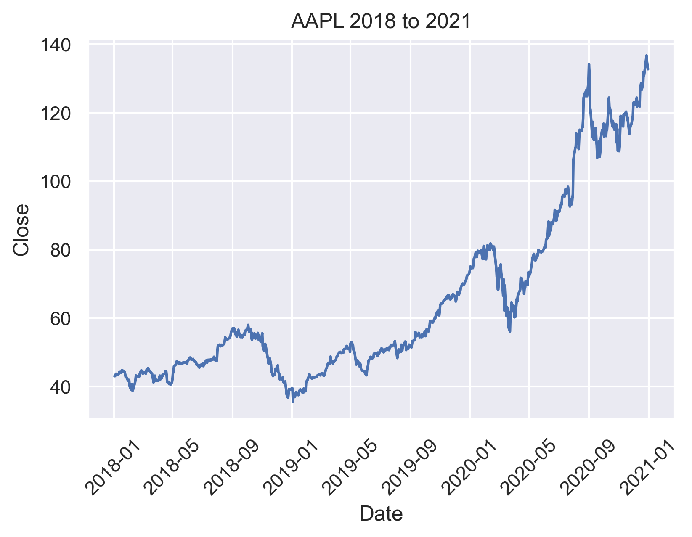

# Getting Stock and ETF data from NASDAQ API

## Getting stock data:

This gets Apple closing price from 2018-01-01 to 2021-01-01:

```python

import pandas as pd
import seaborn as sns
import matplotlib.pyplot as plt
import requests
sns.set()

headers = {
'authority': 'api.nasdaq.com',
'scheme': 'https',
'accept': 'application/json, text/plain, */*',
'accept-encoding': 'gzip, deflate, br',
'accept-language': 'en-US,en;q=0.9',
'origin': 'https://www.nasdaq.com',
'referer': 'https://www.nasdaq.com/',
'sec-ch-ua': "'Google Chrome';v='89', Chromium';v='89', ';Not A Brand';v='99'",
'sec-ch-ua-mobile': '?0',
'sec-fetch-dest': 'empty',
'sec-fetch-mode': 'cors',
'sec-fetch-site': 'same-site',
'user-agent': 'Mozilla/5.0 (Windows NT 10.0; Win64; x64) AppleWebKit/537.36 (KHTML, like Gecko) Chrome/89.0.4389.72 Safari/537.36'
}

params = {'assetclass': 'stocks',
        'fromdate': '2018-01-01',
        'todate': '2021-01-01'
}

url = 'https://api.nasdaq.com/api/quote/AAPL/chart'
r = requests.get(url, headers=headers, params=params)

AAPL = pd.DataFrame(r.json()['data']['chart'])
AAPL = AAPL.drop(columns='z')
AAPL['date'] = pd.to_datetime(AAPL['x'],unit='ms')

```

We can plot it like this:

```python
ax = sns.lineplot(x="date", y="y", data=AAPL)
ax.set(xlabel='Date', ylabel='Close', title='AAPL 2018 to 2021')
plt.xticks(rotation=45)
fig = ax.get_figure()
fig.savefig(r"aapl.png",dpi=300,bbox_inches='tight')
```



## Getting ETF data:

Check out the get_data.py file. You can do stuff like this:


